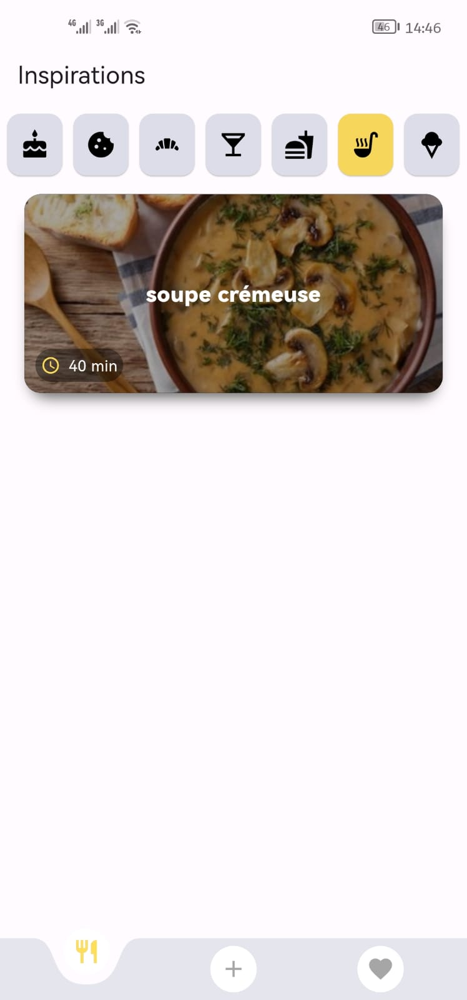

<<<<<<< HEAD
# Cookummy

Cookummy is your go-to recipe companion! Whether you're looking for culinary inspiration or want to save and organize your own creations, Cookummy makes it easy and fun. Discover a world of delicious recipes, save your favorites, and even share them with friends on WhatsApp, Facebook, or any app. With a user-friendly design and seamless functionality, Cookummy is the perfect kitchen assistant for every home cook.

# 🚀 Key Features:

* Recipe Inspiration: Explore a wide variety of recipes for inspiration, including diverse cuisines and cooking styles.

* Save Your Own Recipes: Users can save their own recipes using SQLite for easy access and personal recipe management.

* Favorites List: Mark your favorite recipes and store them for quick access to your most-loved dishes.

* Recipe Sharing: Share your favorite recipes, including images and details, directly to social media platforms like WhatsApp, Facebook, or other apps.

* User-friendly Interface: A clean, simple, and intuitive design making it easy for anyone to find, save, and share recipes.

* Custom Recipe Creation: Add custom recipes with titles, ingredients, cooking instructions, and images, making it easy to personalize the recipe collection.

* Offline Access: Save and access your recipes even when you're offline, allowing you to cook anywhere, anytime.

* Cross-platform Availability: The app is built using Flutter, ensuring smooth performance on both Android and iOS devices.

* Recipe Search and Categories: Easily find recipes through search filters and categories like ingredients, cooking time, or meal type.

* Seamless Recipe Sharing: Quickly share recipes with your friends and family via social media or messaging apps directly from the app.
# 📱 Screenshots:

